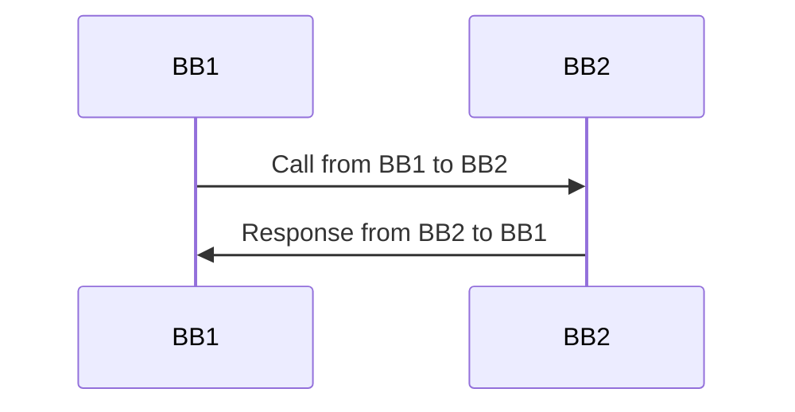

# Template

The following is a template for the creation of an example implementation. Each use case step can be linked to one or more example implementations. A particular example implementation may be used to address multiple use case steps if the processes are generalized sufficiently.

<table data-header-hidden><thead><tr><th width="238"></th><th></th></tr></thead><tbody><tr><td><strong>Use Case Step</strong></td><td>&#x3C;Provide the name and link to the Use Case Step that this example covers></td></tr><tr><td>
<strong>Preconditions</strong>

(list of conditions that MUST be met in order to be able to successfully execute this process)
</td><td> </td></tr><tr><td><strong>Data inputs</strong></td><td> </td></tr><tr><td>
<strong>Actors</strong>

(the people, organization, computer systems - hardware and software, and building blocks that participate in the activity)
</td><td> </td></tr><tr><td><strong>Normal Course</strong> (what happens if the event is triggered and the preconditions have been met)</td><td>
Provide a step-by-step description of the normal flow of this implementation:
<ol><li>
Description of the first thing that happens, including information on data that is entered and/or returned by different actors in the system
<ol><li>Link to Cucumber test file (or embedded cucumber test) that describes the interaction</li><li>List of APIs that are needed from each BB and link to the API documentation</li><li>List of any data structures that are needed and link to the data structures documentation</li></ol></li><li>
Description of the second thing that happens, including information on data that is entered and/or returned by different actors in the system
<ol><li>Link to Cucumber test file (or embedded cucumber test) that describes the interaction</li><li>List of APIs that are needed from each BB and link to the API documentation</li><li>List of any data structures that are needed and link to the data structures documentation</li></ol></li></ol></td></tr><tr><td>
<strong>Alternative Course</strong>

(links to other use cases in case there are different ways how to solve the same use case)
</td><td>Description of alternate paths or flows that may be needed for this example implementation. These alternates should include links to test files, APIs, and data structures as well</td></tr><tr><td><strong>Data output</strong></td><td> </td></tr><tr><td><strong>Post-Conditions</strong> (the success criteria)</td><td> </td></tr><tr><td>
<strong>Exceptions</strong>

(error situations)
</td><td>List of error conditions that may be encountered during the normal or alternative flows. Each error condition should provide information on what data will be returned and guidance on how error conditions should be handled by various actors.</td></tr><tr><td>
<strong>Related BBs</strong>

(working groups related to this implementation example)
</td><td>
Identity BB

Consent BB

Registration BB

Digital Registries BB

Payment BB
</td></tr></tbody></table>

### **Sequence Diagram**

### Links to Code

Provide any links to relevant code that has been developed, such as tests, adaptors and examples, and OpenAPI documentation
