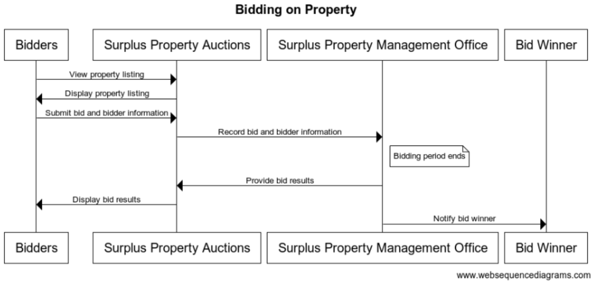

# G2P-UC3-GAM-S.4

<table><thead><tr><th width="200">ID</th><th> G2P-UC3-GAM-S.4</th></tr></thead><tbody><tr><td>Use Case Step</td><td>Bidding on property</td></tr><tr><td>Preconditions</td><td><ul><li>The property has been listed on the Surplus Property Auctions marketplace.</li><li>Bidders are registered and authenticated on the Surplus Property Auctions marketplace.</li></ul></td></tr><tr><td>Data inputs</td><td><ul><li>Bid amount</li><li>Bidder information </li></ul></td></tr><tr><td>Actors</td><td><ul><li>Bidders</li><li>Surplus Property Management Office</li><li>Surplus Property Auctions marketplace</li></ul></td></tr><tr><td>Normal Course</td><td><ol><li>Bidders view the listing of the property on the Surplus Property Auctions marketplace.</li><li>Bidders submit their bid amount and bidder information through the Surplus Property Auctions marketplace.</li><li>Surplus Property Management Office receives and records the bid amounts and bidder information.</li><li>The bidding period ends.</li><li>Surplus Property Management Office reviews the bids and selects the highest bidder.</li></ol></td></tr><tr><td>Alternative Course</td><td>If there are no bids, the Surplus Property Management Office may choose to re-list the property for auction.</td></tr><tr><td>Data output</td><td><ul><li>Winning bid amount</li><li>Bidder information</li></ul></td></tr><tr><td>Post-Conditions</td><td>The highest bidder is identified and notified of their win.</td></tr><tr><td>Exceptions</td><td><ul><li>Invalid bid amount or information is submitted.</li><li>Technical issues with the Surplus Property Auctions marketplace.</li><li>Other unforeseen issues that prevent the auction from being completed.</li></ul></td></tr><tr><td>Related BBs</td><td><ul><li>Authentication &#x26; Authorization </li><li>eMarketplace</li></ul></td></tr><tr><td>Sequence Diagram</td><td>
title Bidding on Property

 <code>Bidders->Surplus Property Auctions: View property listing Surplus Property Auctions->Bidders: Display property listing</code>

<code>Bidders->Surplus Property Auctions: Submit bid and bidder information Surplus Property Auctions->Surplus Property Management Office: Record bid and bidder information</code>  <code>Note right of Surplus Property Management Office: Bidding period ends</code>  <code>Surplus Property Management Office->Surplus Property Auctions: Provide bid results Surplus Property Auctions->Bidders: Display bid results</code>

<code>Surplus Property Management Office->Bid Winner: Notify bid winner</code>
</td></tr></tbody></table>

<figure><figcaption></figcaption></figure>
