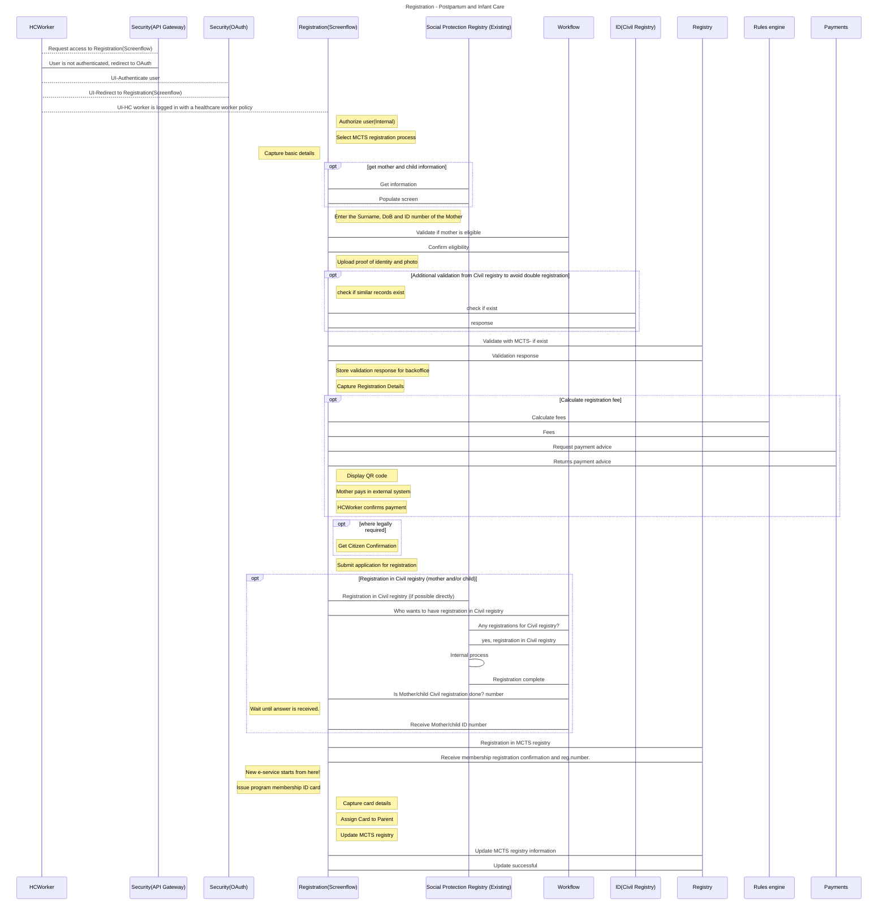

# PP-01-Registration-Example1

<table data-header-hidden><thead><tr><th width="209"></th><th></th></tr></thead><tbody><tr><td><strong>Use Case Step</strong></td><td>Use Case: PostPartum and Infant Care, Step: Registration (provide link to UC when complete)</td></tr><tr><td>
<strong>Preconditions</strong>

(list of conditions that MUST be met in order to be able to successfully execute this process)
</td><td><ul><li> The government-accredited health worker has successfully logged into the MCTS government portal(Registration BB) and has the necessary authorization to complete the registration process of the mother and child into the postpartum care program.</li><li>Data sharing agreement between Registration BB and respective registries where information is queried from has been signed (contract) and respective REST API services in Information Mediator has been opened to Registration BB.</li><li>The mother and newborn have already been registered in a national identification system (ID BB).</li><li>The mother has her identity proof (card, QR code, ID number, etc) available together with the required credentials for the MCC that can be verified and authenticated with the national ID system.</li></ul></td></tr><tr><td><strong>Data inputs</strong></td><td><ol><li>Name of the mother</li><li>National ID number of the mother</li><li>National ID number of the newborn</li><li>Name of the newborn baby</li><li>Place of birth (explain the rationale behind this field)</li><li>Time of birth</li><li>Location of birth</li></ol></td></tr><tr><td>
<strong>Actors</strong>

(the people, organizations, computer systems - hardware and software, and building blocks that participate in the activity)
</td><td>
<strong>Human:</strong> Government-accredited health worker, A woman who has delivered her first baby

<strong>System:</strong>
<ul><li>MCTS/ MCC application (Registration BB)</li><li>Digital Registries BB</li><li>Identity BB</li><li>Consent BB</li><li>Messaging BB</li><li>Information Mediator BB</li><li>National Population Registry (Digital Registries BB or Identity BB)</li><li>MCC Membership Registry (Digital Registries BB)</li></ul></td></tr><tr><td><strong>Normal Course</strong> (what happens if the event is triggered and the preconditions have been met)</td><td>
The registration form screen for the MCC application provides a list of initial details required to proceed with the registration (eligibility verification, required documents, required fees).

<strong>Step 1:</strong> The health worker enters the required initial details, including, but not limited to the following:
<ol><li>Mother’s and newborn baby’s National ID number</li><li>Name of the newborn child</li><li>Date of Birth</li><li>Place of Birth (such as home, clinic, etc.)</li><li>Time of Birth</li><li>Location of Birth</li><li>The health worker (<em>MCC Application</em>) suggests the Mother an option to retrieve additional data from the Population Registry and asks for a consent to do so.</li></ol>
<code>1Feature: Get Consent Agreement 2Scenario: MCC Application retrieves Consent Agreement for Mother 3 Given an Agreement for MCC user registration exists in Consent BB 4 And MCC Application has MCC application has Mother's &#x3C;ID> and authentication token for the registration session 5 When MCC application fetches a Consent Agreement for MCC user registration 6 Then MCC application gets a valid Draft Consent Agreement associated with Mother's ID 7</code>API Endpoints

 

<strong>Step 2:</strong> The health worker (via MCC Application) introduces to the Mother the Consent Agreement for fetching the relevant details from the Population registry for verification and appropriate use with the MCC and captures signature to the Consent Agreement from the Mother.

<code>1Feature: Sign Consent Record 2 3Background: 4 Given MCC Application has the Draft Consent Agreement associated with Mother's ID 5 And MCC application has Mother's &#x3C;ID> and authentication token for the registration session 6 And Mother has read the Draft Consent Agreement 7 And Mother approves to sign the Draft Consent Agreement associated with Mother's ID 8 9Scenario: Sign Consent Record on Paper 10 Given MCC application has captured the consent in a digital form (for example: scan of a paper form) 11 When MCC sends digital Consent Record payload to Consent BB 12 Then Consent BB digitally signs Consent Record 13 And Consent BB confirms to MCC Application that Consent Record for Mother has been successfully signed 14 15Scenario: Sign Consent Record Digitally 16 Given Mother has capability to sign Consent Record digitally 17 When MCC sends the Draft Consent Agreement to Consent BB 18 Then Consent BB creates a paired ConsentRecord and Signature object 19 And Consent BB digitally signes Consent Record 20 And Consent BB confirms to MCC Application that Consent Record for Mother has been successfully signed 21</code>API Endpoints

 

<strong>Step 3:</strong> The MCC application form submits the verified national ID number to the Population registry hosted in the IDBB/Digital Registries BB seeking relevant details of the mother, by invoking the API “Data read value” on the Govstack Digital Registries BB.

This scenario uses a set of features:
<ul><li>Verify Consent Record by Consent BB</li><li>Import data from a registry by Registry BB</li></ul>
<code>1Feature: Verify Consent Record 2MCC Application verifies if Mother has signed Consent Record to fetch the needed personal data from Population registry for MCC user registration 3 4Scenario: Retrieve valid Consent Record 5Given Mother has Signed Consent Record stored in Consent BB 6When MCC Application makes the request to population registry API to fetch Mother's personal data 7Then MCC Application makes prior request to Consent BB API to retrieve Mother's Signed Consent Record 8 And Consent BB sends the signed Consent Record to MCC Application 91Feature: Imports client personal data from a registry 2Import Mother's pesonal information from Population Registry to the e-service form 3 4Given Mother has entered &#x3C;ID> in the Registration e-service registration form, national ID number field 5 And MCC Application has received Signed Consent Record from Consent BB 6 When the MCC Application user pushes a button "Import Mothers's information" 7 Then the MCC Application makes a request to Population Registry API 8 And Population Registry returns requested data to MCC Application 9 And MCC Application fills the form on the screen with Mothers data &#x3C;ID>,&#x3C;first>, &#x3C;last>, &#x3C;birth> 10 Examples: 11 |ID|first|last|birth| 12 |53|Sowmya|Krishnamurti|2022-11-01| 13 14</code>API Endpoints

 

In response, the Govstack IDBB/ Digital Registries BB is expected to return the following:

 

Data returned from Registy

                               
</td></tr><tr><td>
<strong>Alternative Course</strong>

(links to other use cases in case there are different ways how to solve the same use case)
</td><td>
If the mother does not possess a national ID, the registration application needs to provide an alternate mechanism for the health worker to verify the details of the mother. GetIdentityProfile - elaborate
<ol><li>If the consent record is previously created and available, the registration application should fetch the consent agreement by invoking the API: “serviceListIndividualRecord” on the Govstack Consent BB</li></ol>
“GET /dataconsumer/consent/”
</td></tr><tr><td><strong>Data output</strong></td><td>
The successful completion of the postpartum and infant care registration process will result in confirmation and issuance of a program-specific ID that can be used by the mother for future interactions with the program.

Expected data from Registration BB

                               
</td></tr><tr><td><strong>Post-Conditions</strong> (the success criteria)</td><td> The mother and child are registered in the mother and child care program registry.</td></tr><tr><td>
<strong>Exceptions</strong>

(error situations)
</td><td><ul><li>
A child can be only registered once in MCC. The system must prevent multiple registrations.
<ul><li>Provide details on exception code and message</li><li><em>Mitigation steps:</em> Describe steps to be taken by the actors</li></ul></li><li>
If the mother is not registered in Population Registry, then it is not possible to register in MCC.
<ul><li>Provide details on exception code and message</li><li><em>Mitigation steps:</em> Describe steps to be taken by the actors</li></ul></li><li>
If Identity BB or Consent BB is not available (service outage), then …..
<ul><li><em>Mitigation steps:</em> Describe steps to be taken by the actors</li></ul></li><li>
If no internet, then the system is not available and information must be collected on paper forms or on offline data capturing devices.
<ul><li><em>Mitigation steps:</em> Describe steps to be taken by the actors</li></ul></li><li>
If the child is not registered in Population Registry, then the system must enable integrated government service and the child's information must be collected during the same process and forwarded to the correct registration process (Identity BB API to register a new child and issue an ID number for the child).
<ul><li><em>Mitigation steps:</em> Describe steps to be taken by the actors</li></ul></li></ul></td></tr><tr><td>
<strong>Related BBs</strong>

(working groups related to this example implementation)
</td><td>
Identity BB

Consent BB

Registration BB

Digital Registries BB
</td></tr></tbody></table>

### Sequence Diagram

